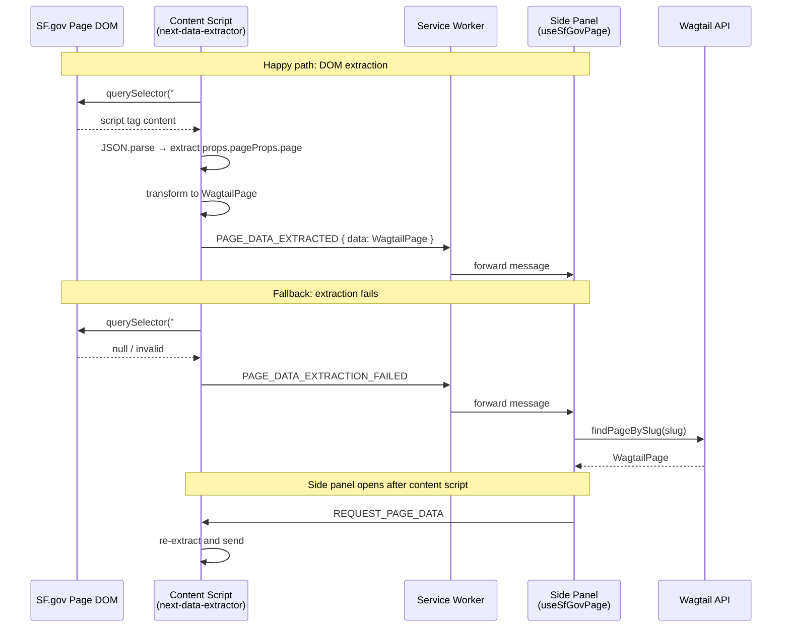

# Design Document: Next Data Page Extraction

## Overview

This feature replaces the Wagtail API network call with direct DOM extraction of page data from the `__NEXT_DATA__` script tag present on all SF.gov Next.js pages. A content script injected into SF.gov pages extracts and transforms the data, then sends it to the side panel via Chrome extension messaging. The side panel falls back to the existing Wagtail API client when extraction fails (e.g., missing script tag, malformed data, or admin pages).

The key architectural change is introducing a new content script (`next-data-extractor.ts`) that runs on SF.gov pages, a pure transformation module (`page-data-transformer.ts`) that converts raw `__NEXT_DATA__` props into the existing `WagtailPage` interface, and modifications to the `useSfGovPage` hook to prefer DOM-extracted data over API-fetched data.

## Architecture



The content script runs at `document_idle`, so the `__NEXT_DATA__` tag is guaranteed to be present if the page is a Next.js page. The side panel may open before or after the content script sends its initial message, so a request/response mechanism is included.

## Components and Interfaces

### 1. Content Script: `next-data-extractor.ts`

Location: `packages/extension/src/content/next-data-extractor.ts`

Responsibilities:
- Locate and parse the `__NEXT_DATA__` script tag
- Transform raw page data into `WagtailPage` format using the transformer
- Send `PAGE_DATA_EXTRACTED` or `PAGE_DATA_EXTRACTION_FAILED` messages
- Respond to `REQUEST_PAGE_DATA` messages from the side panel

```typescript
// message types sent by the content script
interface PageDataExtractedMessage {
	type: "PAGE_DATA_EXTRACTED";
	data: WagtailPage;
	timestamp: number;
}

interface PageDataExtractionFailedMessage {
	type: "PAGE_DATA_EXTRACTION_FAILED";
	reason: string;
	timestamp: number;
}

// message type received by the content script
interface RequestPageDataMessage {
	type: "REQUEST_PAGE_DATA";
}
```

### 2. Transformer: `page-data-transformer.ts`

Location: `packages/extension/src/api/page-data-transformer.ts`

Responsibilities:
- Convert raw `__NEXT_DATA__` page props into a `WagtailPage` object
- Reuse extraction logic for images, files, and translations from the existing wagtail-client where possible
- Compute the `editUrl` and `meta` fields from the raw data

This module is placed in `src/api/` alongside the existing `wagtail-client.ts` since it performs the same kind of data transformation. It is a pure function module with no side effects, making it straightforward to test.

```typescript
/**
 * transforms raw __NEXT_DATA__ page props into a WagtailPage object
 * @param rawPageData - the page object from props.pageProps.page
 * @param currentUrl - the current page URL for determining admin base URL
 * @returns a WagtailPage object matching the shared interface
 */
function transformNextDataToWagtailPage(
	rawPageData: Record<string, unknown>,
	currentUrl: string
): WagtailPage;
```

### 3. Service Worker Updates

Location: `packages/extension/src/background/service-worker.ts`

Changes:
- Add forwarding for `PAGE_DATA_EXTRACTED` and `PAGE_DATA_EXTRACTION_FAILED` message types in the existing `chrome.runtime.onMessage` listener

### 4. Hook Updates: `useSfGovPage`

Location: `packages/extension/src/sidepanel/hooks/useSfGovPage.ts`

Changes:
- Listen for `PAGE_DATA_EXTRACTED` messages and use the data directly
- Listen for `PAGE_DATA_EXTRACTION_FAILED` messages and trigger API fallback
- On mount/tab change for SF.gov pages, send `REQUEST_PAGE_DATA` to the content script on the active tab
- Skip DOM extraction path for admin pages (continue using API directly)

### 5. Manifest Updates

Location: `packages/extension/manifest.config.ts`

Changes:
- Add a new content script entry for `next-data-extractor.ts` matching `*://*.sf.gov/*` but excluding `api.sf.gov` subdomains
- Set `run_at: "document_idle"`

## Data Models

### Raw `__NEXT_DATA__` Structure

The `__NEXT_DATA__` script tag contains a JSON object with this relevant structure:

```typescript
interface NextDataPayload {
	props: {
		pageProps: {
			page: {
				id: number;
				title: string;
				meta: {
					slug: string;
					type: string;
					detail_url: string;
					html_url: string;
					locale: string;
				};
				primary_agency?: {
					id: number;
					title: string;
					meta?: { html_url?: string };
				};
				schema?: {
					_id: string;
					title: string;
					project: string;
				};
				confirmation_title?: string;
				confirmation_body?: Array<{ type: string; value: string }>;
				// nested content blocks containing image and document references
				[key: string]: unknown;
			};
		};
	};
}
```

### Transformation Mapping

| `__NEXT_DATA__` field | `WagtailPage` field | Notes |
|---|---|---|
| `id` | `id` | Direct mapping |
| `title` | `title` | Direct mapping |
| `meta.slug` | `slug` | Direct mapping |
| `meta.type` | `contentType` | Direct mapping |
| `primary_agency` | `primaryAgency` | Map `meta.html_url` → `url` |
| `schema` | `schema` | Direct mapping |
| `confirmation_title/body` | `formConfirmation` | Same parsing as wagtail-client |
| Nested image blocks | `images` | Recursive extraction, same logic as `extractImages` |
| Nested document blocks | `files` | Recursive extraction, same logic as `extractFiles` |
| `meta.locale` + siblings | `translations` | Extract from `__NEXT_DATA__` translation data if available |
| Computed | `editUrl` | `{adminBaseUrl}pages/{id}/edit/` |
| `meta.*` | `meta` | Map `type`, `detail_url`, `html_url` |

### Message Types

```typescript
// messages from content script → service worker → side panel
type ContentScriptMessage =
	| { type: "PAGE_DATA_EXTRACTED"; data: WagtailPage; timestamp: number }
	| { type: "PAGE_DATA_EXTRACTION_FAILED"; reason: string; timestamp: number };

// messages from side panel → content script
type SidePanelMessage =
	| { type: "REQUEST_PAGE_DATA" };
```


## Correctness Properties

*A property is a characteristic or behavior that should hold true across all valid executions of a system — essentially, a formal statement about what the system should do. Properties serve as the bridge between human-readable specifications and machine-verifiable correctness guarantees.*

### Property 1: JSON path extraction produces page object

*For any* valid JSON string containing an object at `props.pageProps.page`, parsing the string and extracting that path SHALL return the exact object at that path.

**Validates: Requirements 1.2**

### Property 2: Transformer produces complete WagtailPage with correct field mapping

*For any* raw page data object with an `id`, `title`, `meta.slug`, `meta.type`, and a valid current URL, the Page_Data_Transformer SHALL produce a WagtailPage where:
- `id` matches the input `id`
- `title` matches the input `title`
- `slug` matches the input `meta.slug`
- `contentType` matches the input `meta.type`
- `editUrl` equals `{adminBaseUrl}pages/{id}/edit/`
- `translations` is an array
- `images` is an array
- `files` is an array
- `meta.type`, `meta.detailUrl`, and `meta.htmlUrl` are present
- When `primary_agency` is present in the input, `primaryAgency` is present in the output with matching `id` and `title`

**Validates: Requirements 2.1, 2.2, 2.6**

### Property 3: Media asset extraction preserves all assets

*For any* raw page data containing embedded image blocks (with `type: "image"` and a `value.id`) and document blocks (with `type: "document"` and a `value.id`), the Page_Data_Transformer SHALL produce a WagtailPage where every unique image id appears in the `images` array and every unique document id appears in the `files` array.

**Validates: Requirements 2.3, 2.4**

### Property 4: Translation extraction preserves all locales

*For any* raw page data containing translation entries with distinct locale codes, the Page_Data_Transformer SHALL produce a WagtailPage where the `translations` array contains one entry per unique locale, each with a valid `languageCode`, `pageId`, and `editUrl`.

**Validates: Requirements 2.5**

## Error Handling

### Content Script Errors

| Error Condition | Behavior | Message Type |
|---|---|---|
| `__NEXT_DATA__` element not found | Send failure message with reason | `PAGE_DATA_EXTRACTION_FAILED` |
| JSON.parse throws | Send failure message with reason | `PAGE_DATA_EXTRACTION_FAILED` |
| `props.pageProps.page` path missing | Send failure message with reason | `PAGE_DATA_EXTRACTION_FAILED` |
| Transformer throws | Send failure message with reason | `PAGE_DATA_EXTRACTION_FAILED` |
| `chrome.runtime.sendMessage` fails | Log error, no retry (side panel will request) | N/A |

### Side Panel Fallback

When the side panel receives `PAGE_DATA_EXTRACTION_FAILED` or does not receive `PAGE_DATA_EXTRACTED` within a reasonable time, it falls back to the existing Wagtail API client. The fallback path is identical to the current behavior, so no new error handling is needed there.

### Message Staleness

Messages include a `timestamp` field. The side panel should ignore messages older than 5 seconds (consistent with the existing preview message handling) to avoid applying stale data from a previous page navigation.

## Testing Strategy

### Property-Based Testing

Use `fast-check` as the property-based testing library for TypeScript. Each property test should run a minimum of 100 iterations.

Property tests target the pure transformation logic:

1. **Property 1** — Test `extractNextDataPage` (the JSON parsing + path extraction function) with generated valid JSON payloads. Tag: `Feature: next-data-page-extraction, Property 1: JSON path extraction produces page object`

2. **Property 2** — Test `transformNextDataToWagtailPage` with generated raw page data objects containing required fields. Verify all output fields are correctly mapped. Tag: `Feature: next-data-page-extraction, Property 2: Transformer produces complete WagtailPage with correct field mapping`

3. **Property 3** — Test `transformNextDataToWagtailPage` with generated page data containing random numbers of embedded image and document blocks. Verify all asset ids appear in the output. Tag: `Feature: next-data-page-extraction, Property 3: Media asset extraction preserves all assets`

4. **Property 4** — Test `transformNextDataToWagtailPage` with generated page data containing random translation entries. Verify all locales appear in the output. Tag: `Feature: next-data-page-extraction, Property 4: Translation extraction preserves all locales`

### Unit Testing

Unit tests complement property tests for specific examples and edge cases:

- Extraction with missing `__NEXT_DATA__` tag (edge case from 1.3)
- Extraction with invalid JSON content (edge case from 1.4)
- Extraction with valid JSON but missing `props.pageProps.page` path (edge case from 1.5)
- Transformer with minimal valid input (specific example)
- Transformer with `primary_agency` present and absent
- Transformer with `schema` and `formConfirmation` fields
- editUrl generation for production vs staging URLs

### Integration Considerations

The Chrome messaging layer (content script ↔ service worker ↔ side panel) is best tested manually or with browser extension integration test frameworks. The design intentionally keeps the pure logic (extraction + transformation) separate from the messaging layer to maximize testability.
