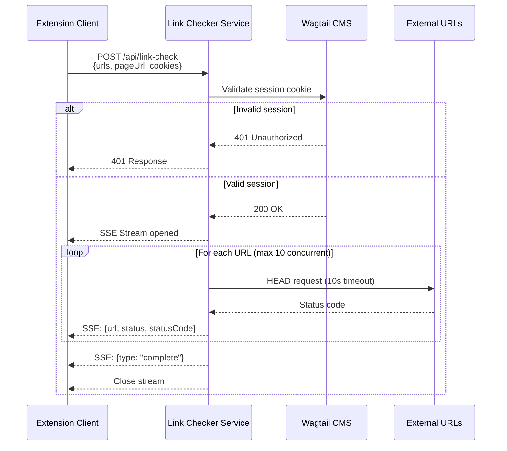

# Design Document: Server-Side Link Checking

## Overview

This design implements a server-side link checking system that overcomes CORS limitations of the current client-side implementation. The system uses a Vercel serverless function to validate links with proper authentication, streaming results back to the client using Server-Sent Events (SSE) for real-time feedback.

The architecture consists of three main components:
1. **Link Checker Service** - Vercel serverless function (`/api/link-check`) that validates URLs
2. **Extension Client** - Browser extension UI that initiates checks and displays results
3. **Authentication Layer** - Wagtail session validation to prevent abuse

## Architecture

### High-Level Flow



### Component Interaction

The system follows a request-response-stream pattern:
1. Client sends batch of URLs with authentication
2. Service validates authentication synchronously
3. Service opens SSE stream and validates links asynchronously
4. Client receives and displays results incrementally
5. Service closes stream when complete or on error

## Components and Interfaces

### 1. Link Checker Service (`/api/link-check.ts`)

**Responsibilities:**
- Validate Wagtail session authentication
- Parse and validate request payload
- Stream link validation results via SSE
- Handle rate limiting and concurrency
- Detect client disconnection

**Interface:**

```typescript
// Request
interface LinkCheckRequest {
	urls: string[];          // URLs to validate (max 200)
	pageUrl: string;         // Source page URL for context
}

// Response (SSE events)
interface LinkCheckResultEvent {
	url: string;
	status: "ok" | "broken" | "redirect" | "timeout" | "error" | "insecure";
	statusCode?: number;
	finalUrl?: string;       // For redirects
	error?: string;          // For errors
}

interface LinkCheckCompleteEvent {
	type: "complete";
	total: number;
	checked: number;
}

interface LinkCheckErrorEvent {
	type: "error";
	message: string;
}
```

**Key Functions:**

```typescript
// Main handler
async function handler(req: VercelRequest, res: VercelResponse): Promise<void>

// Authentication
async function validateWagtailSession(cookies: string): Promise<boolean>

// Link validation
async function checkLink(url: string, pageUrl: string): Promise<LinkCheckResultEvent>

// Stream management
function sendSSE(res: VercelResponse, data: object): void
function closeSSE(res: VercelResponse): void
```

### 2. Extension Client Updates

**New API Client (`/api/link-check-client.ts`):**

```typescript
interface LinkCheckClientOptions {
	urls: string[];
	pageUrl: string;
	onResult: (result: LinkCheckResultEvent) => void;
	onComplete: (summary: LinkCheckCompleteEvent) => void;
	onError: (error: string) => void;
}

class LinkCheckClient {
	private eventSource: EventSource | null = null;
	private abortController: AbortController;

	async startCheck(options: LinkCheckClientOptions): Promise<void>;
	abort(): void;
}
```

**Updated LinkCheckerCard Component:**

```typescript
// Replace chrome.scripting.executeScript with server API call
const handleRunCheck = async () => {
	const client = new LinkCheckClient();
	
	await client.startCheck({
		urls: links.map(l => l.url),
		pageUrl: currentPageUrl,
		onResult: (result) => {
			// Update UI incrementally
			setResults(prev => [...prev, result]);
			setProgress(prev => ({ ...prev, checked: prev.checked + 1 }));
		},
		onComplete: (summary) => {
			setHasRun(true);
			setIsLoading(false);
			setCachedResults(pageUrl, results);
		},
		onError: (error) => {
			setError(error);
			setIsLoading(false);
		}
	});
};
```

### 3. Authentication Layer

**Wagtail Session Validation:**

The service validates sessions by making a request to the Wagtail admin API with the provided cookies. This approach:
- Leverages existing Wagtail authentication
- Requires no additional user management
- Works with existing session cookies from the extension

```typescript
async function validateWagtailSession(cookieHeader: string): Promise<boolean> {
	try {
		const response = await fetch(`${WAGTAIL_BASE_URL}/admin/api/main/pages/`, {
			method: "HEAD",
			headers: {
				"Cookie": cookieHeader,
			},
		});
		return response.status === 200;
	} catch (error) {
		return false;
	}
}
```

## Data Models

### Link Validation State Machine

```
┌─────────┐
│ Pending │
└────┬────┘
     │
     ├──→ [HTTP Request] ──→ 2xx ──→ [ok]
     │
     ├──→ [HTTP Request] ──→ 3xx (after redirects) ──→ [redirect]
     │
     ├──→ [HTTP Request] ──→ 4xx/5xx ──→ [broken]
     │
     ├──→ [Timeout] ──→ [timeout]
     │
     ├──→ [Network Error] ──→ [error]
     │
     └──→ [HTTP on HTTPS page] ──→ [insecure]
```

### SSE Event Format

All SSE events follow this structure:

```
data: <JSON>\n\n
```

Examples:

```
data: {"url":"https://example.com","status":"ok","statusCode":200}\n\n

data: {"url":"https://broken.com","status":"broken","statusCode":404}\n\n

data: {"type":"complete","total":50,"checked":50}\n\n

data: {"type":"error","message":"Authentication failed"}\n\n
```

## Correctness Properties

*A property is a characteristic or behavior that should hold true across all valid executions of a system—essentially, a formal statement about what the system should do. Properties serve as the bridge between human-readable specifications and machine-verifiable correctness guarantees.*

### Property 1: Batch size validation
*For any* request payload, if the URLs array contains more than 200 items, the service should reject the request with a 400 error.
**Validates: Requirements 1.2**

### Property 2: URL format validation
*For any* URL in the request payload, if it is not a valid HTTP or HTTPS URL, the service should reject the request with details about invalid entries.
**Validates: Requirements 1.4**

### Property 3: Authentication enforcement
*For any* request without a valid Wagtail session cookie, the service should return a 401 Unauthorized response.
**Validates: Requirements 2.1**

### Property 4: Result streaming completeness
*For any* batch of URLs, the service should send exactly one result event per URL plus one completion event.
**Validates: Requirements 3.2, 3.4**

### Property 5: Status code mapping for success
*For any* link that returns a 2xx status code, the service should report status as "ok".
**Validates: Requirements 4.2**

### Property 6: Status code mapping for redirects
*For any* link that returns a 3xx status code after following redirects, the service should report status as "redirect" with the final URL.
**Validates: Requirements 4.3**

### Property 7: Status code mapping for errors
*For any* link that returns a 4xx or 5xx status code, the service should report status as "broken" with the status code.
**Validates: Requirements 4.4**

### Property 8: Mixed content detection
*For any* HTTP link when the pageUrl is HTTPS, the service should report status as "insecure".
**Validates: Requirements 4.6**

### Property 9: Concurrency limit enforcement
*For any* batch of links being checked, the service should never have more than 10 simultaneous requests in flight.
**Validates: Requirements 5.1**

### Property 10: Domain rate limiting
*For any* two requests to the same domain, the service should enforce at least a 100ms delay between starting them.
**Validates: Requirements 5.2**

### Property 11: Error isolation
*For any* batch of URLs where some fail, the service should still check all remaining URLs and return results for each.
**Validates: Requirements 6.1**

### Property 12: Result grouping
*For any* set of link check results, grouping by status should produce groups where all items in each group have the same status value.
**Validates: Requirements 7.3**

### Property 13: SSE event format consistency
*For any* result event sent by the service, it should match the format `data: {"url": "...", "status": "...", ...}\n\n`.
**Validates: Requirements 8.5**

## Error Handling

### Authentication Errors
- **Invalid/Missing Session**: Return 401 with JSON error message
- **Wagtail API Unavailable**: Return 503 with retry-after header
- **Session Validation Timeout**: Return 504 after 5 seconds

### Request Validation Errors
- **Invalid JSON**: Return 400 with parse error details
- **Missing Required Fields**: Return 400 with field names
- **Invalid URL Format**: Return 400 with list of invalid URLs
- **Batch Size Exceeded**: Return 400 with current and maximum batch size

### Link Checking Errors
- **Network Errors**: Retry up to 2 times with exponential backoff (100ms, 200ms)
- **Timeout**: Report as "timeout" status after 10 seconds
- **DNS Resolution Failure**: Report as "error" with DNS error message
- **SSL/TLS Errors**: Report as "error" with certificate error details
- **Too Many Redirects**: Report as "error" after 5 redirect hops

### Streaming Errors
- **Client Disconnection**: Detect via `res.on('close')` and stop processing
- **Write Errors**: Log error and attempt to send error event before closing
- **Execution Timeout**: Send partial results and completion event after 60 seconds

### Error Logging
All errors should be logged with structured context:
```typescript
{
	timestamp: string;
	error: string;
	requestId: string;
	url?: string;
	statusCode?: number;
	retryCount?: number;
}
```

## Testing Strategy

### Unit Testing
Unit tests will verify specific examples and edge cases:

**Authentication Module:**
- Valid Wagtail session returns true
- Invalid session returns false
- Missing cookies returns false
- Network errors return false

**Request Validation:**
- Valid payloads pass validation
- Invalid URL formats are rejected
- Batches over 200 URLs are rejected
- Missing required fields are rejected

**Link Checking:**
- 2xx status returns "ok"
- 4xx/5xx status returns "broken"
- Redirects return "redirect" with finalUrl
- Timeout returns "timeout"
- HTTP on HTTPS page returns "insecure"
- Network errors return "error"
- sf.gov normalization works correctly

**SSE Streaming:**
- Events are formatted correctly
- Completion event is sent
- Error events are sent on failures

### Property-Based Testing
Property tests will verify universal properties across many generated inputs using a property-based testing library (e.g., fast-check for TypeScript):

**Configuration:** Each property test should run a minimum of 100 iterations.

**Property Tests:**

1. **Batch Size Validation** (Property 1)
   - Generate random payloads with 0-300 URLs
   - Verify those ≤200 are accepted, >200 are rejected
   - Tag: `Feature: server-side-link-checking, Property 1: Batch size validation`

2. **URL Format Validation** (Property 2)
   - Generate random strings and valid HTTP/HTTPS URLs
   - Verify only valid URLs pass validation
   - Tag: `Feature: server-side-link-checking, Property 2: URL format validation`

3. **Authentication Enforcement** (Property 3)
   - Generate requests with various cookie combinations
   - Verify only valid Wagtail sessions are accepted
   - Tag: `Feature: server-side-link-checking, Property 3: Authentication enforcement`

4. **Result Streaming Completeness** (Property 4)
   - Generate random batches of URLs
   - Verify event count = URL count + 1 (completion)
   - Tag: `Feature: server-side-link-checking, Property 4: Result streaming completeness`

5. **Status Code Mappings** (Properties 5-7)
   - Generate random HTTP status codes
   - Verify correct status mapping for each range
   - Tag: `Feature: server-side-link-checking, Property 5-7: Status code mapping`

6. **Mixed Content Detection** (Property 8)
   - Generate random HTTP/HTTPS URL combinations
   - Verify insecure status when HTTP on HTTPS page
   - Tag: `Feature: server-side-link-checking, Property 8: Mixed content detection`

7. **Concurrency Limit** (Property 9)
   - Generate batches of varying sizes
   - Monitor concurrent requests, verify ≤10
   - Tag: `Feature: server-side-link-checking, Property 9: Concurrency limit enforcement`

8. **Domain Rate Limiting** (Property 10)
   - Generate URLs with repeated domains
   - Verify 100ms+ delay between same-domain requests
   - Tag: `Feature: server-side-link-checking, Property 10: Domain rate limiting`

9. **Error Isolation** (Property 11)
   - Generate batches with some failing URLs
   - Verify all URLs are checked regardless of failures
   - Tag: `Feature: server-side-link-checking, Property 11: Error isolation`

10. **Result Grouping** (Property 12)
    - Generate random result sets
    - Verify grouping produces homogeneous groups
    - Tag: `Feature: server-side-link-checking, Property 12: Result grouping`

11. **SSE Event Format** (Property 13)
    - Generate random result events
    - Verify all match SSE format specification
    - Tag: `Feature: server-side-link-checking, Property 13: SSE event format consistency`

### Integration Testing
Integration tests will verify end-to-end flows:
- Full request flow with valid authentication
- 401 response with invalid authentication
- SSE stream with multiple links
- Error handling across components
- Client disconnection handling
- Timeout enforcement

### Manual Testing Checklist
- Test with real Wagtail session cookies
- Test with various link types (ok, broken, redirect, timeout)
- Test with large batches (100+ links)
- Verify SSE streaming in browser DevTools
- Test error scenarios (invalid auth, network errors)
- Verify UI updates in real-time
- Test cache behavior (10-minute expiry)
- Test refresh button functionality